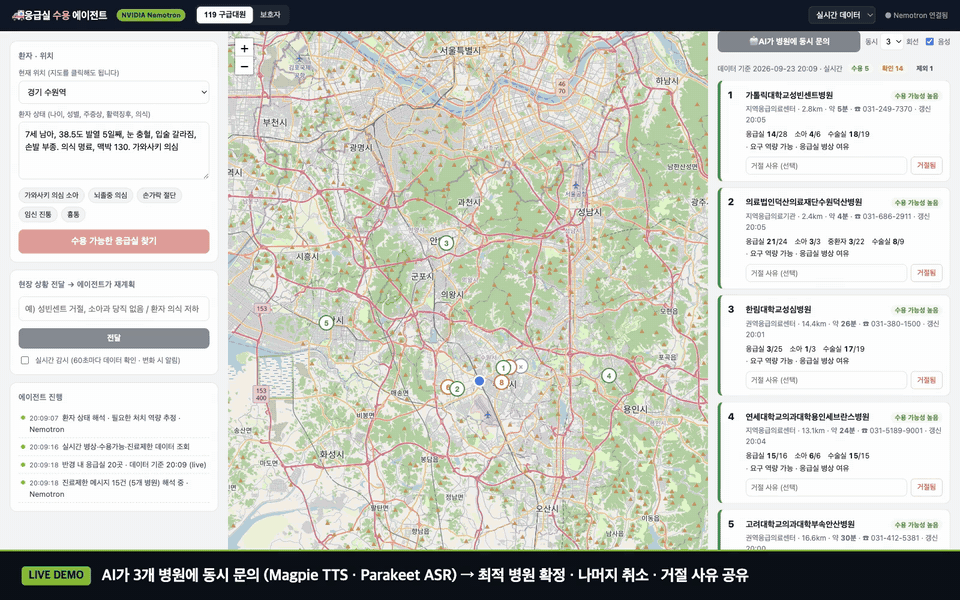

# 🚑 er-agent — 응급실 수용 에이전트

구급차가 환자를 태우고도 받아줄 응급실을 찾지 못해 전화를 돌리는 동안, 골든타임은 흘러갑니다.
**er-agent**는 이 과정을 에이전트가 대신합니다. 실시간 공공데이터로 후보를 좁히고, 자유 문장으로 된 진료제한 메시지를 환자 조건과 현재 시각에 맞춰 해석한 뒤, 여러 병원에 **동시에** 수용 문의를 걸어 받아줄 곳을 확보합니다.

NVIDIA Nemotron · NIM · NeMo Agent Toolkit · NeMo Guardrails · OpenShell · Speech NIM(Magpie TTS / Parakeet ASR) 위에서 동작합니다.

## 데모

[](demo/er-agent-demo.mp4)

▶️ **[전체 데모 영상 보기 (2분 33초, mp4)](demo/er-agent-demo.mp4)** — 한국어 내레이션(Magpie TTS)과 실제 통화 음성 포함

<video src="demo/er-agent-demo.mp4" poster="demo/assets/poster.png" controls width="100%"></video>

| 장면 | 내용 |
|---|---|
| 가와사키 의심 7세 (수원역) | 가장 가까운 권역센터가 `소아심장분과 부재 … (가와사키환자 포함)` 메시지로 **제외**되고, 소아 병상이 있는 병원이 먼저 추천된다 |
| AI 병렬 문의 | 상위 3곳에 동시에 음성 문의 → 1순위 우선 확정 · 나머지 정중히 취소 · 거절 사유 공유. 녹화 중 가드레일이 `혈압 · 산소포화도` 날조 발화를 실제로 차단 |
| 현장 이벤트 | "확정 병원 취소 통보, 아이 상태 악화" → 에이전트가 거절 기록 · 중증도 상향 · 재계획 · 재문의 |
| 보호자 모드 | 위험 징후가 있으면 119 신고를 먼저 권고하고, 지금 갈 수 있는 응급실을 안내 |

> 병원 통화는 **시뮬레이션**입니다. 가상 병원 담당자는 실제 스냅샷(병상·진료제한 메시지)과 병원별 고정 난수로 만든 "숨은 사정"으로 답합니다. 실제 응급실에 테스트 전화를 걸지 마세요.

## 동작 흐름

```
환자 설명 ─▶ ① 환자 평가 (Nemotron)            필요한 처치 역량 추정 · 진단 아님
          ─▶ ② 실시간 데이터 (국립중앙의료원)   병상 · 중증질환 27종 수용 여부 · 진료제한 메시지
          ─▶ ③ 진료제한 메시지 해석 (Nemotron)  "월~금 9A~5P30' 진료가능" 같은 문장을 환자·현재 시각에 대입
          ─▶ ④ 순위 (규칙)                       A 수용 가능성 높음 / B 전화 확인 / X 제외 + 사유
          ─▶ ⑤ AI 병렬 문의 (물결 방식)          동시 N회선 · 1순위 우선 확정 · 나머지 취소
                 음성: Magpie TTS → (병원) → Parakeet ASR → Nemotron
                 가드레일: 기록에 없는 환자 사실은 말하지 못하게 차단
          ─▶ ⑥ 현장 이벤트 재계획 (NeMo Agent Toolkit)  거절 기록 · 중증도 상향 · 재계획 · 재문의
          ─▶ ⑦ 거절 공유 보드                     통화로 알게 된 거절 사유를 다른 출동 건의 순위에 반영
```

두 가지 사용자 모드가 있습니다.

- **구급대원 모드** — 수용 문의 멘트 생성, AI 병렬 문의, 거절 버튼, 현장 이벤트 입력, 60초 감시(데이터 변화 시 알림)
- **보호자 모드** — 위험 징후 판단 → 119 권고 배너, 지금 갈 수 있는 응급실 목록

## 왜 에이전트인가

국립중앙의료원 데이터는 실시간이지만(측정 시 전국 416개 응급실, 갱신 중앙값 4분), 그대로는 판단할 수 없습니다.

- 중증질환 수용 정보의 약 **2/3가 "정보미제공"** → 결국 전화 확인이 필요
- 진료제한 메시지 700여 건이 **자유 문장**이라 규칙으로 해석할 수 없음

| 메시지 (실제) | 환자 / 시각 | 판정 |
|---|---|---|
| 소아심장분과 의료진 부재 … 진료 및 입원 일시적 불가(가와사키환자 포함) | 가와사키 의심 7세 | `block` |
| 인력 부족으로 월~금 9A ~ 5P30' 진료가능 | 목요일 21:10 | `block` (진료 시간 외) |
| [혈액종양내과] 신환 수용 불가, FU 환자 가능 | 본원 추적 환자 / 타원 신환 | `none` / `block` |
| [구강악안면외과] 단순 치아 질환 응급실 진료 불가 | 가와사키 의심 7세 | `none` |

## 빠른 시작

요구사항: Python 3.13, [uv](https://docs.astral.sh/uv/), 아래 두 키.

```bash
cat > .env <<'EOF'
data_key=<공공데이터포털 인증키 — 국립중앙의료원_전국 응급의료기관 정보 조회 서비스>
nvidia_api_key=<build.nvidia.com API 키 (nvapi-...)>
EOF

uv sync
uv run er-agent serve                 # http://127.0.0.1:8000
```

터미널에서:

```bash
uv run er-agent plan "7세 남아, 38.5도 발열 5일째, 가와사키 의심" --at 37.2657,127.0000
uv run er-agent plan "..." --replay 20260923173330   # 저장된 스냅샷으로 재현 (공공데이터 키 불필요)
uv run er-agent collect --every 300 --count 12        # 5분 간격 스냅샷 수집
```

실시간 조회는 매번 `data/cache/snapshots/<시각>/`에 저장되고, UI 우상단에서 재생 스냅샷을 고를 수 있습니다.

> macOS에서 프로젝트가 iCloud 동기화 폴더(데스크톱·문서)에 있으면 iCloud가 `.venv`의 `.pth` 파일을 숨김 처리해 `ModuleNotFoundError`가 납니다. `UV_PROJECT_ENVIRONMENT=.venv.nosync uv sync` 후 `ln -s .venv.nosync .venv`, 실행은 `uv run --no-sync`.

## NeMo Agent Toolkit 워크플로

에이전트의 기능이 NAT 도구로 등록되어 있습니다 (`src/er_agent/nat_tools.py`, 엔트리포인트 `nat.components`).

```bash
uv run nat run --config_file configs/dispatch.yml \
  --input "수원역(37.2657, 127.0000)에서 7세 남아, 가와사키 의심. 받아줄 응급실을 확보해줘."
uv run nat serve --config_file configs/dispatch.yml
```

도구: `dispatch_plan`, `call_hospitals`, `mark_rejected`, `update_patient`, `move_origin`, `replan`, `rejection_board`.
웹 UI의 "현장 상황 전달"도 이 워크플로를 거칩니다 (`ER_AGENT_ENGINE=builtin`이면 내장 루프).

## 안전장치

### 통화 가드레일 (NeMo Guardrails 출력 레일)

통화 중 AI가 하는 모든 말은 `src/er_agent/rails/`의 출력 레일을 거칩니다.

1. 기록에 없는 임상 용어(의식·혈압·병력·보관 방법 …)가 들어간 문장 → 즉시 차단
2. Nemotron이 발화를 사실 단위로 쪼개 환자 기록의 원문 구절을 인용 → 코드가 문자열·수치로 검증
3. 검사 자체가 실패하면 차단 (fail-closed)

차단된 발화는 `그 부분은 기록에 없어 정확하지 않습니다. 구급대원이 직접 말씀드리도록 바로 연결하겠습니다.`로 바뀝니다.

개발 중 확인한 실패와 대응: 프롬프트 규칙만으로는 "얼음 팩에 넣어 보관"을 지어냄 → 한 번에 "근거 있음?"을 묻는 판정은 모델이 근거를 보기 전에 `true`를 답함 → 사실 단위 인용 + 코드 검증 → 인용은 맞지만 더 일반적인 근거("활력징후 안정" ⇒ "혈압 120/80")를 막기 위한 수치 검증과 `supports` 판정 → 모델이 사실 추출을 건너뛰는 경우를 막는 임상 용어 백스톱.

### OpenShell 샌드박스 (`deploy/openshell/`)

에이전트는 환자 상태와 구급차 위치를 다루므로 NVIDIA OpenShell 샌드박스에서 실행할 수 있습니다.

```bash
DOCKER_CONTEXT=colima deploy/openshell/up.sh   # 이미지 빌드 → provider 등록 → 샌드박스 + UI 포워딩(:8000)
deploy/openshell/verify.sh                     # 샌드박스 안에서 공격 시도 11종
openshell logs er-agent | grep DENIED          # 차단된 연결 로그 (OCSF)
```

| 통제 | 설정 |
|---|---|
| 키 은닉 | `er-nim`(Bearer 헤더), `nemc`(`serviceKey` 쿼리) provider. 샌드박스에는 `openshell:resolve:env:…` placeholder만 있고, 프록시가 허용된 엔드포인트로 나갈 때만 실제 키로 치환 |
| 네트워크 | `integrate.api.nvidia.com` `POST /v1/chat/completions`·`GET /v1/models`, `apis.data.go.kr` `GET /B552657/ErmctInfoInqireService/*` 만 허용 |
| 실행 파일 | Python 인터프리터만 (자식 프로세스는 부모 권한을 물려받지만 L7 경로 제한은 그대로) |
| 파일 | 코드 `/app` 읽기 전용, 쓰기는 `/sandbox`·`/tmp`만 (Landlock) |
| 음성 | Speech NIM은 gRPC라 키 치환·L7 검사가 불가 → 샌드박스에서는 `ER_VOICE=0` |

`verify.sh` 결과: **11/11** — placeholder만 존재, NIM·공공데이터 정상 호출, 환자 정보 외부 전송 차단, placeholder 타 호스트 전송 차단, 공공데이터 POST·다른 서비스 차단, 허용 호스트의 비허용 경로 차단, 프록시 우회 소켓 차단, 코드 변조 차단, 셸의 curl 차단. 운영 중에는 의존성 라이브러리의 `events.telemetry.data.nvidia.com` 전송 시도도 정책이 차단했습니다.

설치 메모 (OpenShell 0.0.116, macOS Homebrew): `/opt/homebrew/var/openshell/gateway.toml`에 `compute_drivers = ["docker"]`와 `[openshell.drivers.docker] socket_path`(colima 소켓)를 지정해야 게이트웨이가 뜹니다. 이미지 `PATH`는 적용되지 않으므로 실행 명령은 절대 경로로 줍니다.

## Cloudflare Containers 배포 (`deploy/cloudflare/`)

```
Worker (Basic Auth) ──▶ Durable Object ──▶ Container (basic: 1/4 vCPU · 1 GiB · 4 GB, 요청 없으면 10분 뒤 sleep)
```

```bash
cd deploy/cloudflare && npm install
DOCKER_HOST=unix://$HOME/.colima/default/docker.sock npx wrangler deploy   # linux/amd64 이미지 빌드 (docker buildx 필요)
printf '%s' "$KEY" | npx wrangler secret put NVIDIA_API_KEY                # DATA_KEY, DEMO_PASSWORD도 동일
ACCOUNT_ID=<cloudflare account id> ./usage.sh                              # 이번 달 Containers 사용량 / 포함량
```

- 비용: Workers Paid($5/월)에 메모리 25 GiB-h · vCPU 375분 · 디스크 200 GB-h 포함. 메모리·디스크는 **할당량** 기준, CPU만 실사용 기준이라 basic 인스턴스는 **월 약 25시간 무료**. 앱 최대 RSS는 약 255 MB.
- 재배포 후 Durable Object가 이전 인스턴스를 정상으로 기억해 `not running` 오류가 나면 Worker가 한 번 `destroy()` 후 재시도합니다. 시작 옵션(envVars·egress)은 실행 중인 인스턴스에 적용되지 않으므로 바꿀 때 인스턴스 이름을 올립니다.
- `@cloudflare/containers` 0.3.7에서 `enableInternet=false` + `allowedHosts`는 HTTP만 통과시키고 HTTPS(NIM)·gRPC(Speech NIM)는 타임아웃되어, 이 배포는 인터넷을 열고 Basic Auth로만 보호합니다. 호스트 단위 통제가 필요하면 OpenShell을 쓰세요.
- 상태 점검: `GET /api/diag` (NIM · 공공데이터 · Speech gRPC), `?full=true`는 실제 환자 평가 호출까지.

## 평가 (재현: `evals/`)

```bash
uv run python evals/restrictions_eval.py   # 진료제한 메시지 판정
uv run python evals/guard_eval.py          # 가드레일 (3스레드 동시, 3회 반복)
```

| 항목 | 결과 |
|---|---|
| 진료제한 메시지 판정 (요일·시간대, 신환/기존환자, 무관 메시지) | 10/10 |
| 가드레일: 14개 발화 × 3회 | 42/42, **날조 발화 누출 0** |
| 계획 1회 | 약 10~18초 |
| 음성 포함 병렬 문의 1회 | 약 12~30초 |
| NAT 워크플로 전체 (계획 + 문의 + 요약) | 약 45초 |

## 구조

| 경로 | 역할 |
|---|---|
| `src/er_agent/nemc.py` | 국립중앙의료원 OpenAPI 클라이언트, 스냅샷 기록/재생 |
| `src/er_agent/catalog.py` | 명세서(V13) 기준 필드 사전 — 병상 코드, 중증질환 27종 |
| `src/er_agent/triage.py` | 환자 설명 → 요구 역량 (Nemotron 도구 호출, 키 없으면 키워드 규칙) |
| `src/er_agent/restrictions.py` | 진료제한 메시지 × 환자 × 현재 시각 → block / caution / none |
| `src/er_agent/planner.py` | 거리·병상·역량·판정 → 등급과 연락 순서 |
| `src/er_agent/agent.py` | 출동 세션, 현장 이벤트 처리(NAT), 감시 루프 |
| `src/er_agent/calls.py` | 물결 방식 병렬 문의, 가상 병원 담당자, 1순위 우선 확정 |
| `src/er_agent/guard.py`, `rails/` | NeMo Guardrails 출력 레일 |
| `src/er_agent/nat_tools.py`, `configs/dispatch.yml` | NeMo Agent Toolkit 플러그인과 워크플로 |
| `src/er_agent/voice.py` | Speech NIM (Magpie TTS ko-KR, Parakeet 1.1b 다국어 ASR) |
| `src/er_agent/board.py` | 거절 공유 보드 (30분 TTL) |
| `src/er_agent/server.py`, `web/` | FastAPI + NDJSON 스트림, 지도 UI |
| `deploy/openshell/`, `deploy/cloudflare/` | 샌드박스 정책·프로필, Containers 배포 |
| `demo/` | 데모 영상과 제작 스크립트 (`build/`: 내레이션 → 녹화 → 조립) |

## 사용 모델

- `nvidia/nemotron-3-super-120b-a12b` (build.nvidia.com 호스팅 NIM) — 평가, 메시지 해석, 재계획, 통화, 가드레일. 구조화 호출은 `enable_thinking=False` (약 7배 빠르고 평가셋 정확도 동일)
- Magpie TTS Multilingual (ko-KR) / Parakeet 1.1b RNNT Multilingual ASR (NVCF gRPC)

## 한계

- 병원 통화는 시뮬레이션입니다. 실제 운영에는 응급실 전화 부담, AI 고지, 개인정보 최소화, 구급대원 3자 연결 등 현장 절차와의 협의가 필요합니다.
- 이동 시간은 직선거리 × 1.35 / 평균속도 추정입니다. 길찾기 API로 교체가 필요합니다.
- 진단 도구가 아닙니다. 요구 처치 역량 추정과 병원 선정·연락 보조만 합니다.
- build.nvidia.com 무료 호출 한도(429)에 걸리면 지수 백오프로 재시도하고, 동시 NIM 요청은 3개로 제한합니다 (`ER_NIM_CONCURRENCY`).
- 컨테이너는 보통 UTC이므로 모든 시각은 `config.now_kst()`(Asia/Seoul)로 계산합니다. 진료제한 판정이 이 값에 의존합니다.

## 데이터 출처

[국립중앙의료원 전국 응급의료기관 정보 조회 서비스](https://www.data.go.kr/data/15000563/openapi.do) (공공데이터포털). API 호출에는 개인 인증키가 필요합니다.
